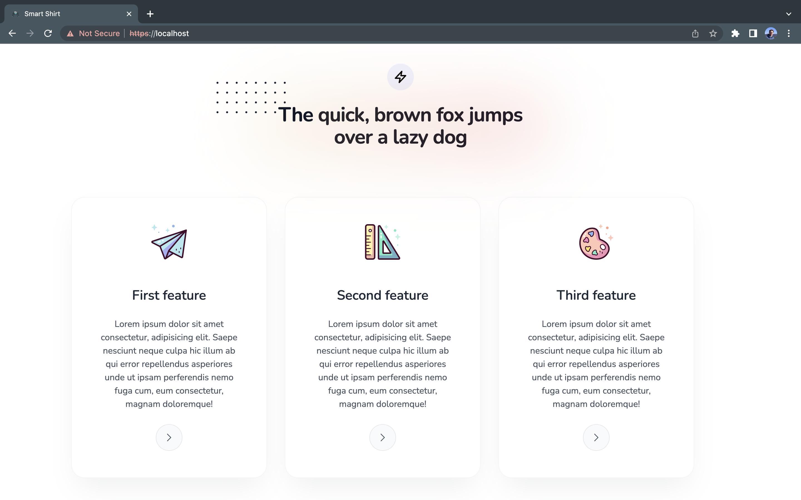

# Create ai generated images of T-Shirts

<!-- reference a person with github account (https://github.com/shubham4315) -->

My friend [Shubham](https://github.com/shubham4315) and I have created a website where you can create your own T-Shirt designs with the help of AI.

## How to use

1. Clone the repository
2. Replace the API keys in the `.env` file
3. Run `docker compose up` in the root directory
4. Open `localhost` in your browser

The application is build with [Api Platform](api-platform.com) and [React](https://react.dev/). We used tailwindcss for styling.

## How it looks

### Home page

### Ai Editor

### Settings

### Order

